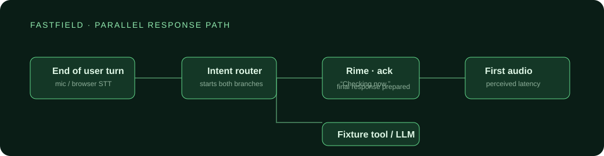

# FastField

FastField is an immediate voice copilot for field technicians. Its hard voice problem is the silence after a worker finishes speaking, when an equipment lookup is still running. It uses Rime as the only spoken-output provider: a short acknowledgement begins synthesis before the complete lookup result is ready, then Rime speaks the result.



## The voice claim

**FastField reduces perceived response time by starting a useful Rime-generated acknowledgement before its tool response is available.**

The measured product metric is `first audible Rime audio − end of user turn`. Judge Mode shows that metric alongside the server-side Rime time-to-first-byte, lookup time, and final-answer completion time. There is no browser speech-synthesis fallback: if Rime is unavailable, FastField reports that explicitly instead of substituting another TTS provider.

## Run locally

Requirements: Node 22+ and a Rime API key.

```powershell
Copy-Item .env.example .env
# Add RIME_API_KEY to .env
npm.cmd install
npm.cmd run dev
```

Open `http://localhost:5173`. The Vite UI proxies API calls to `http://localhost:8787`.

Try **“What’s wrong with pump four?”**. Keep **Stress test** enabled to add a real two-second lookup delay. You should hear Rime say “Checking pump four now” before the final lookup result arrives.

For production, run `npm.cmd run build` and host the static `dist/` directory on Cloudflare Pages. This repository includes the equivalent serverless API proxy in [`workers/index.ts`](workers/index.ts): deploy it with `npm.cmd run deploy:worker`, set `RIME_API_KEY` with `npx wrangler secret put RIME_API_KEY`, and set `VITE_API_BASE_URL=https://<your-worker>.<your-subdomain>.workers.dev` in the Pages build environment. Do not expose the Rime key to the browser. Set `ALLOWED_ORIGIN` as a Worker secret to the final Pages origin rather than leaving the development wildcard in a public deployment.

## Architecture

```text
Browser microphone / typed test prompt
  → browser end-of-turn timestamp and optional Web Speech transcription
  ├─ → Rime HTTP stream: short acknowledgement → MediaSource playback
  └─ → fixture-backed equipment lookup (optionally delayed)
                                      ↓
                          Rime HTTP stream: final answer → playback
```

The acknowledgement and lookup begin in parallel. Audio is serialized so the technician never hears overlapping turns. A monotonically increasing turn ID, an `AbortController`, and a stopped audio element fence stale results: a new request cancels the previous Rime stream and lookup before it can speak an obsolete equipment result.

This MVP intentionally uses a controlled local fixture rather than a broad RAG system. That makes correct answers, delays, and benchmark prompts repeatable. The fixture is in [`fixtures/equipment.json`](fixtures/equipment.json).

## Rime configuration

The active values are surfaced by `/api/health` and Judge Mode. Configure them in `.env`; use the current Rime catalog at submission time.

| Setting | Default | Purpose |
| --- | --- | --- |
| Model ID | `mistv3` | Low-latency Rime model |
| Speaker | `cove` | Default Rime voice; verify catalog access before submission |
| Language | `eng` | English synthesis language |
| Endpoint | `https://users.rime.ai/v1/rime-tts` | Streaming HTTP endpoint; select an appropriate regional endpoint in production |
| Format | `audio/mpeg` | Browser MediaSource playback |
| Transport | HTTP response stream | API key remains server-side |

Acknowledgements are deliberately written without numerals or abbreviations and request `noTextNormalization: true`; answers keep normal text normalization. The server uses `speedAlpha: 1.07` for the Mist v3 convention. Consult the [current Rime latency guidance](https://docs.rime.ai/docs/latency) and [regional endpoint documentation](https://docs.rime.ai/docs/regional-endpoints) before deployment.

## Acceptance test

The authoritative user-visible test is the browser test in [`RIME_EVIDENCE.md`](RIME_EVIDENCE.md). Run it in the same deployed path that will be demonstrated: same Rime endpoint, server region, model, speaker, HTTP transport, and audio format.

The optional command below collects a separate server-side diagnostic across the fixed 20-prompt corpus. It does **not** claim to measure audible browser playback and must never be substituted for the acceptance-test result.

```powershell
# Start the API first in another terminal.
$env:BENCHMARK_TOOL_DELAY_MS = "2000"
npm.cmd run benchmark
```

It writes timestamped JSON records to `evaluation/results/` (ignored by Git). Record warm and cold runs separately. The fixed corpus is [`fixtures/benchmark.json`](fixtures/benchmark.json).

## Stress case: interruption and stale-output fencing

1. Enable the **Stress test** switch.
2. Say or type “Check pump 4.”
3. While FastField says “Checking pump four now,” press the microphone and say “Actually, pump 7.”
4. Pass condition: old audio stops, pump four's delayed answer never plays, and the only final spoken result is for pump seven.

The cancellation behavior is in `src/App.tsx`; the API request itself also observes client aborts.

## Limitations and failure behavior

- Browser Web Speech recognition is browser- and network-dependent. The typed path exists for repeatable input but is not the primary product interaction.
- Chrome-family browsers provide the best `MediaSource` MP3 streaming support. Unsupported browsers receive Rime audio via a complete-blob fallback; Judge Mode should label those runs as non-streaming and they should not be used as latency evidence.
- The current tool is synthetic and intentionally small. Its virtue is controlled correctness, not coverage of a production maintenance system.
- If Rime is unconfigured or fails, no alternative TTS is used. The UI reports the failure, preserving the rule that Rime is the active spoken path.
- End-of-turn timing derives from browser speech recognition on microphone runs. For typed runs, it is the submit event and should be reported separately.

## Third-party services

- [Rime](https://rime.ai/) provides all audible assistant speech.
- Browser Web Speech is used only for prototype STT in microphone-enabled browsers.
- React + Vite power the local web interface.
- Express is a local API proxy so Rime credentials stay off the client.

No user accounts, telemetry service, external database, or alternative TTS provider are used.
